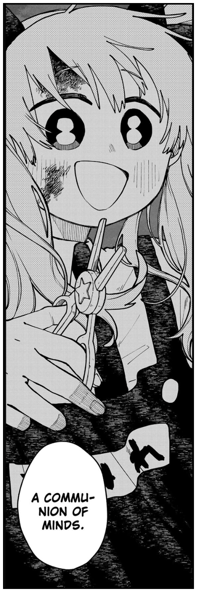

<div align="center">



# una

**A self-hosted Wispr Flow replacement that learns your voice.**<br>
*Hold a hotkey anywhere, speak, release — clean text lands in the focused app.*

</div>

---

Everything runs on your own hardware: Whisper (via faster-whisper) for transcription and a local
LLM (via Ollama) that strips filler words, punctuates, and adapts tone to the app you're dictating
into. And the longer you use it, the better it gets: every dictation is recorded, your corrections
become training pairs, and once enough accumulate, una LoRA-fine-tunes Whisper **on your own
voice**, evaluates the result against the current model, and hot-swaps it in — only if it's
actually better.

```
┌─ client (Tauri: macOS + arm64 Linux) ────┐      ┌─ server (your NVIDIA Linux box) ─────────┐
│ tray + floating HUD + settings           │ LAN  │ FastAPI                                  │
│ global hotkey → record 16kHz             │─────▶│  faster-whisper (CUDA)                   │
│ POST wav → receive text → paste-inject   │◀─────│   → Ollama cleanup (falls back to raw)   │
│ mDNS auto-discovery of _una._tcp         │      │  SQLite + WAV history                    │
└──────────────────────────────────────────┘      │  web dashboard: home · review ·          │
                                                  │    dictionary · training · insights      │
                                                  │  fine-tune: LoRA → WER gate → hot-swap   │
                                                  └──────────────────────────────────────────┘
```

## ⚠️ Security model

una has **no authentication** by design — it is a private-network tool. The server holds
recordings of everything you dictate and can swap the model it serves. **Never port-forward it
to the internet.** To use it away from home, put the server on a private network
(Tailscale/WireGuard) — see [docs/remote-access.md](docs/remote-access.md) — or bind it to
`127.0.0.1` and SSH-tunnel.

## Server quickstart (NVIDIA GPU Linux box)

```sh
git clone <this repo> && cd una
docker compose up -d --build          # una-server on :8100 + Ollama on :11434
docker exec -it una-ollama-1 ollama pull qwen3:8b
```

Open `http://<box>:8100` for the dashboard — your transcript feed, review queue, dictionary,
training runs and usage insights, in light or dark. First dictation downloads the Whisper
model (~1.6 GB) into the `hf-cache` volume.

Without Docker: `cd server && uv sync --extra training && uv run uvicorn una_server.main:app --host 0.0.0.0 --port 8100`.

Configuration: copy `server/una.toml.example` to `una.toml` (or use `UNA__SECTION__KEY` env
vars — see the example file for everything tunable).

### GPU sizing

| VRAM | ASR | Cleanup LLM | Training | Suggested config |
|------|-----|-------------|----------|------------------|
| ≥16 GB | large-v3-turbo fp16 (~2 GB) | 8B q4 (~6 GB) | runs alongside serving | defaults |
| 12 GB | large-v3-turbo fp16 | 3–4B model | `training.pause_serving = true` | `cleanup.model = "qwen3:4b"` |
| 8 GB | `compute_type = "int8_float16"` | 3–4B model | `pause_serving = true` | both of the above |

## Client (macOS + arm64 Linux)

See [docs/macos-install.md](docs/macos-install.md) and [docs/linux.md](docs/linux.md).

```sh
make          # build → reset stale permission grants → install Una.app + una CLI → launch
make dmg      # or: build a distributable dmg and reveal it in Finder
make update   # refresh an installed client: stop → remove → build → install → relaunch
```

First launch of a dmg-installed (unsigned) app: right-click → Open (or `xattr -cr /Applications/Una.app`).
Dev loop instead: `make ui-build && make client-dev` (needs `cargo install tauri-cli --version '^2'`).

Point it at your server in Settings (or let mDNS discovery find it), grant microphone +
accessibility permissions, then hold `Ctrl+Alt+Space` and talk. Three hotkey modes:
**hold** (push-to-talk), **toggle** (tap to start/stop), **hybrid** (default — a quick tap
latches, a hold behaves like push-to-talk).

### Dictating from anywhere

Settings → Server takes a **list** of addresses and each dictation goes to whichever answers
first, so the same setup works on your home network and on a hotel one. Put the LAN address
first for speed and a VPN address (Tailscale/WireGuard) after it; **Test all** shows which are
reachable from where you are. Full walkthrough, including the Tailscale key-expiry trap that
silently kills remote access months later: [docs/remote-access.md](docs/remote-access.md).

## The self-improvement loop

1. Every dictation stores the audio, the raw Whisper transcript, and the LLM-cleaned text.
2. In the dashboard's **Review** page you correct transcripts with a keyboard-driven flow
   (~5 s per utterance). Corrections fix *what was said* — the raw transcript — never the
   cleaned text, so the model learns transcription, not paraphrasing.
3. Corrections that diverge too far from the raw transcript (normalized edit distance > 0.30)
   are auto-excluded as content rewrites. Accepted-as-is reviews count as gold pairs for free.
4. At 30+ minutes of eligible audio (configurable), the **Training** page lets you launch a
   LoRA fine-tune of Whisper on your voice — or flip on **auto-train** in Settings and una
   starts one itself once dictation has been idle for `training.auto_idle_minutes`, there is
   new reviewed data since the last run, and no run is active. ~10% of dictations are frozen
   into a held-out eval split at insert time.
5. The candidate is converted to CTranslate2 and measured against the current production
   model on that held-out set. It is promoted **only if WER improves by ≥0.5 points**, after
   a smoke-test transcription — then hot-swapped into serving with zero restart. One-click
   rollback from the model registry, always.

6. The same loop learns your **style**. The optional *Final text* field in Review collects
   (raw transcript → how you actually wanted it written) pairs; once enough accumulate
   (`training.style_threshold_pairs`, default 50), the Training page can QLoRA-fine-tune the
   cleanup LLM on them. The adapter is layered onto the Ollama base model, both models are
   evaluated through Ollama itself by mean edit distance to your polished targets, and the
   candidate is promoted by switching `cleanup.model` — same gate, same one-click rollback.

Quick wins arrive before any training: add names and jargon to the **Dictionary** and they are
injected into Whisper's decoding prompt and the cleanup prompt immediately.

## Repo layout

- `server/` — FastAPI + faster-whisper + Ollama client + training pipeline (Python, uv)
- `server/dashboard/` — web dashboard (Svelte 5 + Vite + Tailwind 4)
- `client/` — desktop client (Rust workspace + Tauri v2, Svelte HUD/settings)
- `docs/` — install, platform, and remote-access notes

## Development

```sh
make server-test        # server test suite
make client-test        # client FSM tests
make server-dev         # UNA__ASR__DEVICE=cpu UNA__ASR__COMPUTE_TYPE=int8 for GPU-less hacking
make dashboard-dev      # UNA_SERVER=http://<box>:8100 to point the UI at a real server
```
