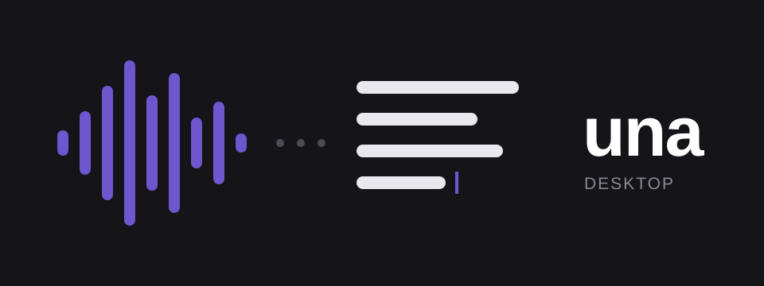

<div align="center">



# una — desktop client

**Hold a hotkey anywhere, speak, release — the transcript is typed into the focused app.**<br>
*Menu-bar client for a self-hosted una server. Nothing leaves your network.*

</div>

---

## How it works

Hold the global hotkey (default `Ctrl+Alt+Space`) in any application. A small
floating HUD shows live microphone levels while you speak. On release, the
audio is resampled to 16 kHz mono WAV and POSTed to your una server on the
LAN; the cleaned transcript comes back and is inserted into the focused app
via clipboard + paste chord, after which your previous clipboard is restored.

Three hotkey modes: **hold** (push-to-talk), **toggle** (press to start /
press to finish), and **hybrid** (default — hold to talk, or tap within
250 ms to latch into toggle).

Afterwards the client watches what you do with the text: fixing it files the
fix as a style target for the cleanup model, leaving it alone files it as a
correct transcription, and both feed the server's fine-tunes without a review
session. Where macOS won't let it read the field — terminals, canvas editors — a
small correction window asks instead, and the tray's **Fix Last Dictation…**
opens that window for the last paste whenever you want it. Settings →
**Learning**, and [docs/learning.md](../docs/learning.md).

The tray's **Review Dictations…** goes through recent dictations one at a time,
with both right answers already drafted by the server's teacher — what you said,
word for word, and how you'd have written it — and the words its second listen
heard differently shown as chips that play just that moment. Listen, press ⌘↵.
See [docs/personal-model.md](../docs/personal-model.md).

## Layout

```
client/
├── crates/
│   ├── una-core        # FSM + controller, audio capture/resample, HTTP,
│   │                   # mDNS discovery, config, spool, IPC (no GUI deps)
│   ├── una-platform    # text injection / permissions / focused-field access
│   │                   # (macOS: NSPasteboard + CGEvent + AX; Linux: XTest/ydotool/wtype)
│   └── una-cli         # `una` — toggle/start/stop/cancel over the unix socket
├── apps/desktop/
│   ├── src-tauri       # tauri v2 app: tray, HUD + settings + correction +
│   │                   # review windows, hotkey, correction capture
│   └── ui              # Svelte 5 + Vite, multi-page (hud, settings, correction, review)
└── scripts/gen_icons.py  # stdlib-only PNG icon generator
```

## Build

```sh
# UI first (the tauri build embeds it)
cd apps/desktop/ui && bun install && bun run build && cd ../../..

cargo run -p una-desktop        # dev run
cargo test -p una-core          # FSM + audio + config + spool tests
cargo tauri build               # release bundles (needs tauri-cli)
```

Or just `make` — it builds everything, resets stale macOS permission grants,
installs the app and the `una` CLI, and launches it.

Platform guides: [macOS install](../docs/macos-install.md) ·
[Linux](../docs/linux.md) (build deps, ydotool setup, compositor keybinds).

## Server

The client talks to the una server's `POST /v1/dictations` and
`GET /v1/health`. `[server] urls` holds an ordered list of addresses; every
dictation goes to whichever answers first, so one config covers the home LAN
and a VPN address for use away from home (see
[remote-access.md](../docs/remote-access.md)). Candidates are probed
concurrently and the winner is cached, so an unreachable address costs no
latency. If none answer and `autodiscover` is on, the client falls back to
servers advertising `_una._tcp` over mDNS.

Configuration lives at the platform config dir (macOS: `~/Library/Application
Support/sh.tenet.una/config.toml`, Linux: `~/.config/una/config.toml`) and is
editable from the settings window (tray → Settings…). An older `url = "..."`
setting is migrated into `urls` on first load.

Failed uploads are spooled (last 5) and can be resent via tray →
**Retry Last Dictation**.
